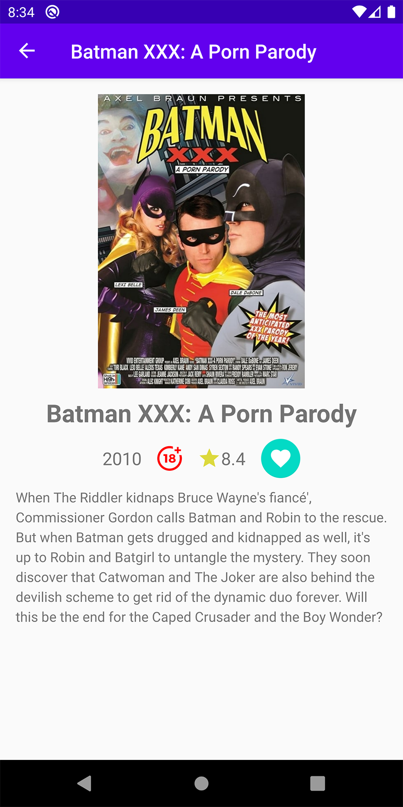

# Android TMDb Movies App

[](http://developer.android.com/index.html)

App made in Kotlin with educational purposes uses [TMDb Developers Api](https://developers.themoviedb.org/3/) in order to get information about movies. Implements MVVM (Model View ViewModel) architecture using the components Navigation, ViewModel, LiveData, Coroutines, Room etc.

## Installation

Clone this repository and import into Android Studio

```
    https://github.com/damrek/Movies-App.git
```

File _local.properties_ must include variable with your own TMDb Developer Api Key

```
    tmdb_api_key = "xxxxxxxxxxxxxxxxxxxxxx"
```

## Demo

<h3 align="center"> Home Screen | Sort Filters **NEW | Movie Search </h3>
<p align="center">
    
    
    
</p>

<h3 align="center">Movie details and Add to Favorites </h3>
<p align="center">
            
            
</p>
 
  
<h3 align="center">Top Menu Options</h3>
<p align="center">
    
    
</p>


## Features :

- Using MVVM (Model-View-ViewModel) Architecture
- Using Room Persistence for local database (favorite movies list)
- Using Retrofit to request api network
- Using Moshi to parse JSON into objects
- Using Glide for loading image from url

## Dependencies :

- [Lifecycle & Livedata](https://developer.android.com/jetpack/androidx/releases/lifecycle)
- [Navigation Component](https://developer.android.com/jetpack/androidx/releases/navigation)
- [Retrofit 2](https://square.github.io/retrofit/)
- [Moshi](https://github.com/square/moshi)
- [Glide](https://github.com/bumptech/glide)
- [AndroidX](https://mvnrepository.com/artifact/androidx)

## Support me

> Just **star** or **fork** this repository, and follow my github. You have _supported_ me!

## Author

[**David Mareca**](https://www.linkedin.com/in/davidme/)
